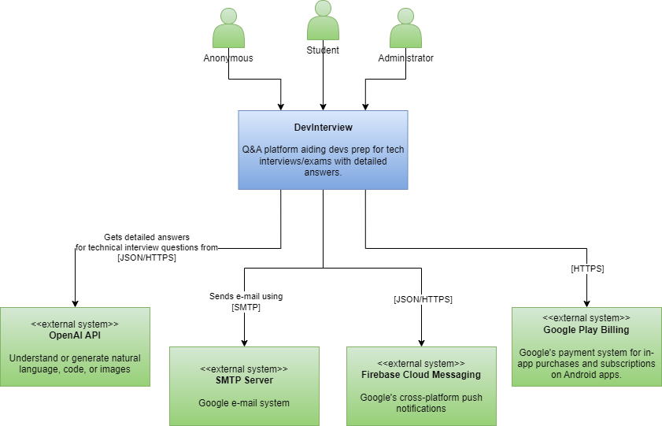
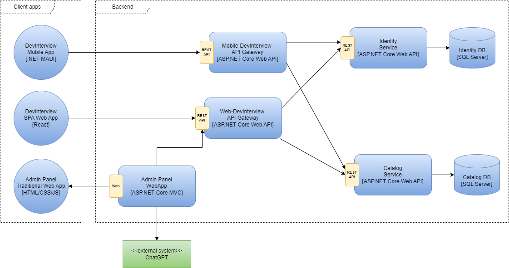

# DevInterview - Software Guidebook

## Introduction

This software guidebook provides an overview of the **DevInterview** application. It includes a summary of the following:

- The requirements, constraints and principles behind the solution.
- The software architecture, including the high-level technology choices and structure of the software.
- The infrastructure architecture and how the software is deployed.
- Operational and support aspects of the application.

<!--
See how it works with a hands on demo.

- Mobile App: https://www.demo.com
- SPA Web App: https://www.demo.com
- Admin Panel: https://www.demo.com
-->

## Context

**DevInterview** is an application designed to assist software developers in preparing for technical interviews or certification exams through questions with respective detailed answers.



### Users

The tool has three types of user:

- **Anonymous**: Anybody with a web browser o smartphone can view free content on the application.
- **Student**: Authenticated user
- **Admin**: People with administrative (super-user) access to the Administration Panel can manage the content that is aggregated into the application.

### External Systems

There are three types of systems that DevInterview integrates with.

- **OpenAI API**: Understand or generate natural language, code, or images.
- **SMTP Server**: Google e-mail system.
- **Firebase Cloud Messaging**: Google's cross platform push notifications.
- **Google Play Billing**: Google's payment system for in-app purchases and subscriptions on Android apps.

## Functional Overview

### Anonymous

- As an anonymous user, I want to be able to access the homepage to explore available content.
- As an anonymous user, I want to be able to view a list of available categories or topics to filter interview questions.
- As an anonymous user, I want the option to register for an account to access additional features.

### Student

- As a Student, I want to be able to log in to my account to access personalized features.
- As a Student, I want the option to update my profile information, such as my email address or password.
- As a Student, I want to be able to browse the interview question catalog to explore different areas of knowledge.
- As a Student, I want to be able to search for specific questions by topic or keyword to quickly find what I need.
- As a Student, I want the option to mark questions as resolved once I have reviewed them.
- As a Student, I want to be able to bookmark questions for later review.
- As a Student, I want to receive notifications about important system updates or newly added questions.
- As a Student, I want to have access to additional resources such as articles, tutorials, or code examples related to interview questions.
- As a Student, I want to have the option to provide feedback on the usefulness and quality of questions and answers to help improve the system.

### Administrator

- As an administrator, I want the ability to add new interview questions to the catalog to expand and keep the content up-to-date.
- As an administrator, I want to be able to edit or delete existing questions in the catalog to correct errors or update information as needed.
- As an administrator, I want to be able to manage the tags or categories associated with questions to ensure consistent organization and facilitate user search.
- As an administrator, I want the ability to send notifications to users about important system updates or new features available.
- As an administrator, I want to be able to manage user accounts, including the ability to create, edit, or delete accounts as needed.
- As an administrator, I want the ability to customize the appearance and settings of the system, including the ability to change the theme, add custom logos, and adjust privacy settings.

## Quality Attributes

This section provides information about the desired quality attributes (non-functional requirements) of the application.

### Performance

All pages on **DevInterview** should load and render in under five seconds, for fifty concurrent users.

### Security

All authentication must be done via a third-party mechanism such as Twitter, Facebook or Google.

### Internationalisation

All user interface text will be presented in English only.

### Browser compatibility

The application should work consistently across the following browsers:

- Chrome
- Edge
- Firefox
- Safari

## Constraints

This section provides information about the constraints imposed on the development of the **DevInterview** application.

### Budget

Since there is no formal budget for the **DevInterview** application, there is a constraint to use free and open source technologies for the development. Ideally, the application should run on a single server with hosting costs of less than 20 USD per month.

## Principles

This section provides information about the principles adopted for the development of the **DevInterview** application.

### Automated testing

The strategy for automated testing is to use automated unit and component tests.

- **Unit tests:** These are fast running, very small tests that operate on a single class or method in isolation.
- **Component tests:** Rather than mocking out database connections to test component internals, components are tested as single units to avoid breaking encapsulation.

### Configuration

All configuration needed by components is externalised into a configuration file, which is held outside of the deployment files created by the build process. This means that builds can be migrated from development, testing and into production without change.

### Logging

- **Logging Framework for .NET:** Serilog
- **Use an optimal structured log format:** By using a structured log with an optimal format, developers ensure that log data is readable, uniform, and easily searchable.

```
2023-03-07T12:15:30+00:00 [INFO] PaymentService - Payment processed successfully for Order #12345
```

- **Do NOT log sensitive information:** API keys, passwords, credentials and more fall under this category. It's far to risky to log anything sensitive as it increases the chances of it leaking and becoming a security problem

```
❌
logger.error("Unable to log in", {request});

✅
logger.error("Unable to log in", {
  username: request.user,
  password: request.pass ? "[HIDDEN]" : null,
// any additional context needed?
})
```

- **Be specific in your messages:** Logging is only as beneficial as the message in the log, therefor, be specific.

```
❌
logger.info("We're starting!")
...
logger.info("task complete!")

✅
logger.info("Starting task", {
  name: taskName,
  params: params,
  startTime: startTime
});

logger.info("task complete", {
  response: output.response,
  event: {
    action: taskName,
    duration: currentTime - startTime
  }
})
```

- **Log all errors:** Logs are a best friend to those debugging, so, as a programmer if you find yourself in a situation writing error handling, make sure you always log the error before throwing a different one for the user. If we don't log the original error then we could find ourselves with no context as too why we're throwing a `SystemError`.

```
catch(err)
{
    logger.error('An error occured', {error: err, args: args});
    throw new SystemError('Unable to process request');
}
```

### Dependency injection

## Software Architecture

This section provides an overview of the **DevInterview** software architecture.

### Containers

The following diagram shows the logical containers that make up the **DevInterview** application. The diagram does not represent the physical number and location of containers - please see the infrastructure and deployment sections for this information.



- **Admin Panel WebApp**: An admin panel serves as a user-friendly control center to maintain various aspects of your web application like managing and organising content, tracking website analytics, managing user accounts, and performing various other tasks.
- **DevInterview SPA**: ...
- **Web-DevInterview API Gateway**: ...
- **Mobile-DevInterview API Gateway**: ...
- **Identity Service**: ...
- **Catalog Service**: ...

## Infrastructure Architecture

This section provides information about the infrastructure architecture of the **DevInterview** application.

## Deployment

This section provides information about the mapping between the **software architecture** and the **infrastructure architecture**. We use a deployment diagram to illustrate how instances of software systems and/or containers in the static model are deployed on to the infrastructure within a given **deployment environment** (e.g. production, staging, development, etc).

## Development

```
docker-compose -f docker-compose.yml -f docker-compose.override.yml up -d
```

Get data with Cloud Firestore
https://firebase.google.com/docs/firestore/query-data/get-data#c

Upload Files Firebase Storage:

- Install FirebaseStore.net
- Activar servicio Storage en Firebase
- Get the "Folder Path" --> gs://devinterview-2aedb.appspot.com and set variable "Bucket"
- Get the "Web Api Key" --> Project Settings
- Create user for authentication: uploadfiles@devinterview.com
- Change Storage Rules: allow read, write: if request.auth != null;
- https://www.youtube.com/watch?v=tDBqEimGcDo
  https://dev.to/airarrazabald/conectando-api-en-net-5-con-firebase-storage-2fhk
