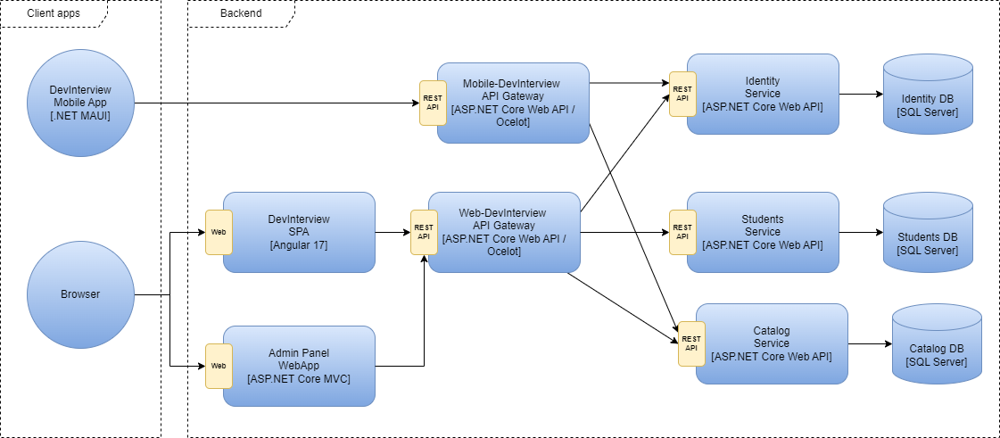

# DevInterview - Software Guidebook

## Introduction

This software guidebook provides an overview of the **DevInterview** tool. It includes a summary of the following:

- The requirements, constraints and principles behind the solution.
- The software architecture, including the high-level technology choices and structure of the software.
- The infrastructure architecture and how the software is deployed.
- Operational and support aspects of the application.

See how it works with a hands on demo.

- Mobile App: https://www.demo.com
- SPA Web App: https://www.demo.com
- Admin Panel: https://www.demo.com

## Context

**DevInterview** is a tool designed to assist software developers in preparing for technical interviews or certification exams through questions with respective detailed answers.


### Users

The tool has three types of user:

- **Anonymous**: Anybody with a web browser o smartphone can view free content on the tool.
- **Student**: Authenticated user
- **Admin**: People with administrative (super-user) access to the Administration Panel can manage the content that is aggregated into the tool.

### External Systems

There are three types of systems that DevInterview integrates with.

- **OpenAI API**: Understand or generate natural language, code, or images.
- **SMTP Server**: Google e-mail system.
- **Firebase Cloud Messaging**: Google's cross platform push notifications.
- **Google Play Billing**: Google's payment system for in-app purchases and subscriptions on Android apps.

## Functional Overview

### Anonymous

- As an anonymous user, I want to be able to access the homepage to explore available content.
- As an anonymous user, I want to be able to view a list of available categories or topics to filter interview questions.
- As an anonymous user, I want the option to register for an account to access additional features.

### Student

- As a Student, I want to be able to log in to my account to access personalized features.
- As a Student, I want the option to update my profile information, such as my email address or password.
- As a Student, I want to be able to browse the interview question catalog to explore different areas of knowledge.
- As a Student, I want to be able to search for specific questions by topic or keyword to quickly find what I need.
- As a Student, I want the option to mark questions as resolved once I have reviewed them.
- As a Student, I want to be able to bookmark questions for later review.
- As a Student, I want to receive notifications about important system updates or newly added questions.
- As a Student, I want to have access to additional resources such as articles, tutorials, or code examples related to interview questions.
- As a Student, I want to have the option to provide feedback on the usefulness and quality of questions and answers to help improve the system.

### Administrator

- As an administrator, I want the ability to add new interview questions to the catalog to expand and keep the content up-to-date.
- As an administrator, I want to be able to edit or delete existing questions in the catalog to correct errors or update information as needed.
- As an administrator, I want to be able to manage the tags or categories associated with questions to ensure consistent organization and facilitate user search.
- As an administrator, I want the ability to send notifications to users about important system updates or new features available.
- As an administrator, I want to be able to manage user accounts, including the ability to create, edit, or delete accounts as needed.
- As an administrator, I want the ability to customize the appearance and settings of the system, including the ability to change the theme, add custom logos, and adjust privacy settings.

## Quality Attributes

abc

## Constraints

abc

## Principles

abc

## Software Architecture



- **Admin Panel**: An admin panel serves as a user-friendly control center to maintain various aspects of your web application like managing and organising content, tracking website analytics, managing user accounts, and performing various other tasks.
- **Web-DevInterview API Gateway**: abc
- **Mobile-DevInterview API Gateway**: abc
- **Identity Service**: abc
- **Catalog Service**: abc

## Infrastructure Architecture

abc

## Deployment

abc

## Development

```
docker-compose -f docker-compose.yml -f docker-compose.override.yml up -d
```

Get data with Cloud Firestore
https://firebase.google.com/docs/firestore/query-data/get-data#c

Upload Files Firebase Storage:

- Install FirebaseStore.net
- Activar servicio Storage en Firebase
- Get the "Folder Path" --> gs://devinterview-2aedb.appspot.com and set variable "Bucket"
- Get the "Web Api Key" --> Project Settings
- Create user for authentication: uploadfiles@devinterview.com
- Change Storage Rules: allow read, write: if request.auth != null;
- https://www.youtube.com/watch?v=tDBqEimGcDo
  https://dev.to/airarrazabald/conectando-api-en-net-5-con-firebase-storage-2fhk
